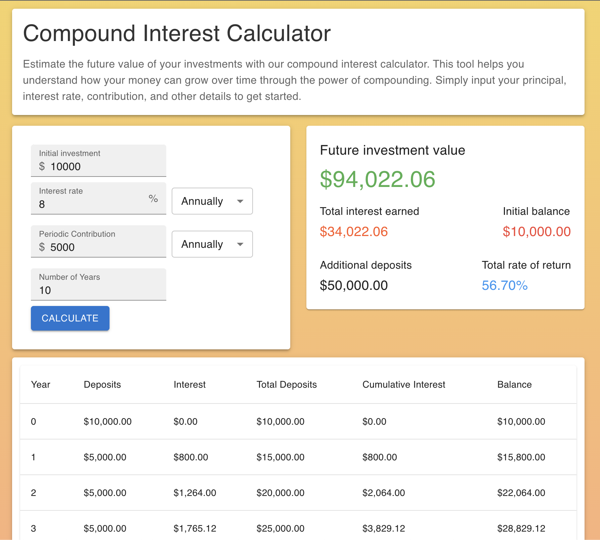

# Compound Interest Calculator

A simple compound interest calculator web application built using React and TypeScript. This tool helps users estimate the future value of their investments over time.

## Features

- User-friendly interface for easy input of financial parameters.
- Provides insights into how investments can grow through compounding.
- Offers a detailed table view for a comprehensive overview of the calculated results.

## Installation

1. Clone the repository: `git clone https://github.com/oekiaby0/react-cinterest.git`
2. Navigate to the project directory: `cd react-cinterest`
3. Install dependencies: `npm install`
4. Run the development server: `npm start`
5. Open the application in your browser at `http://localhost:3000`.

## Usage

- Input your principal amount, interest rate, contribution, and investment duration.
- View calculated results in the table and statistical overview formats.

## Dependencies

- React
- TypeScript
- Material-UI

## Contributing

Contributions are welcome. Please follow the standard GitHub workflow for contributions.

## License

This project is licensed under the GPT3 License. See the [LICENSE](LICENSE) file for details.

Feel free to adapt the above code for your project's specific needs.
